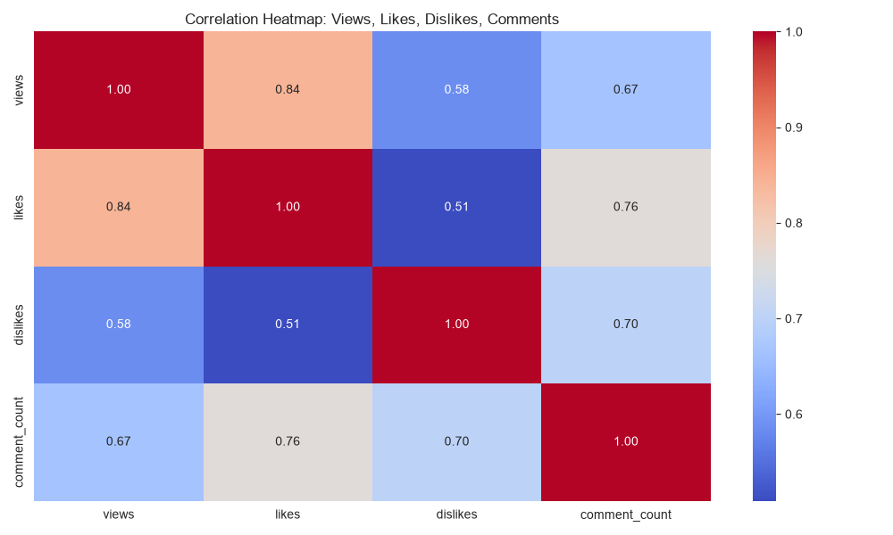
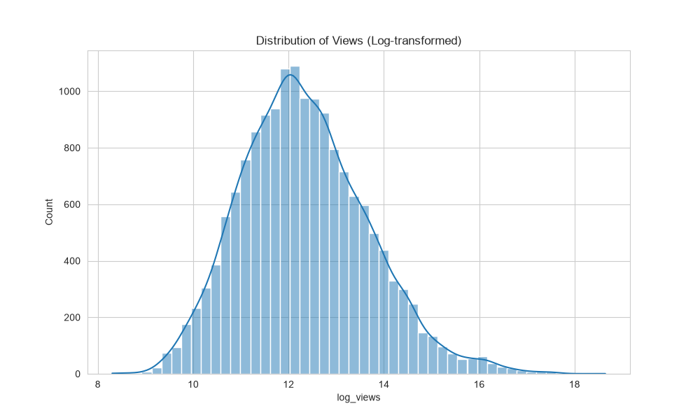
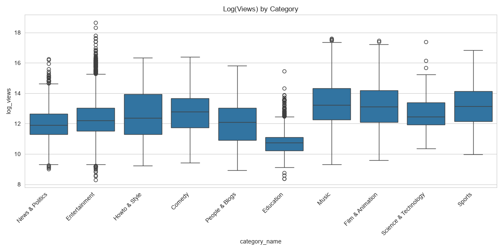
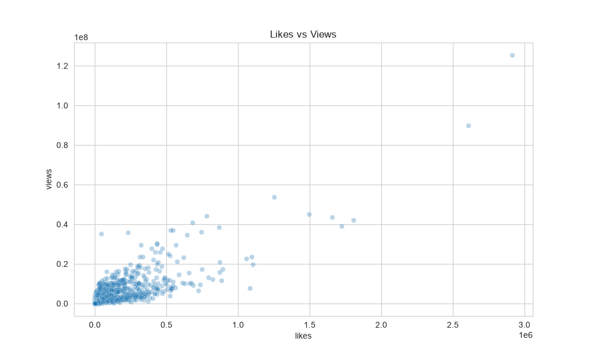
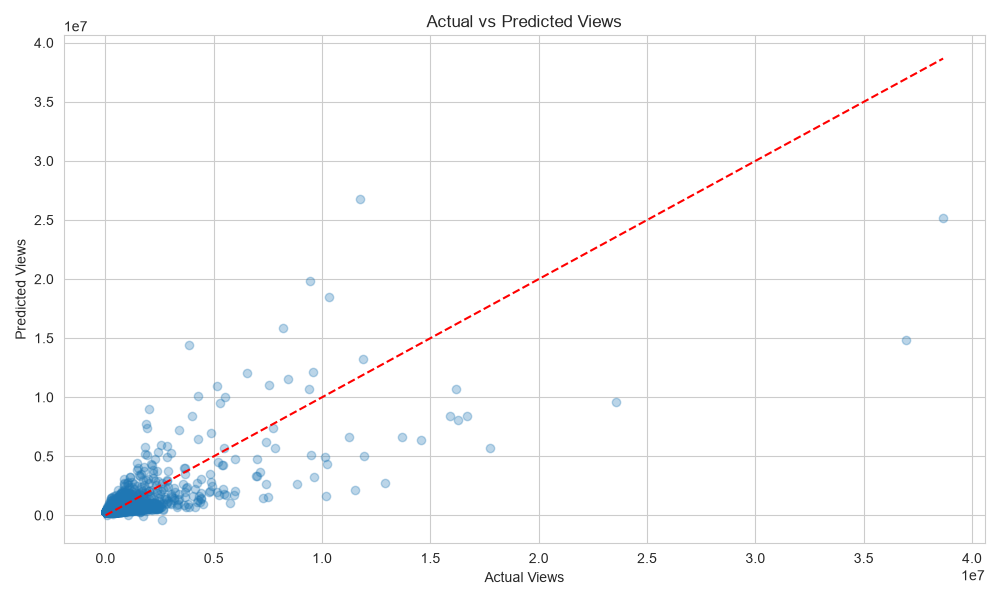

# YouTube Trending Video Analysis

Analysis and prediction of YouTube video popularity using probability and statistical techniques, built as a Probability & Statistics course project.

The project applies descriptive statistics, probability distribution checks, hypothesis testing (ANOVA, t-test), and multiple linear regression on YouTube's trending video dataset (India region) to understand what drives a video's view count.

## Dataset

- **Source:** [Trending YouTube Video Statistics](https://www.kaggle.com/datasnaek/youtube-new) (Kaggle, by datasnaek)
- **Region used:** India (`INvideos.csv` + `IN_category_id.json`)
- Fields: video ID, trending date, title, channel, category, publish time, tags, views, likes, dislikes, comment count

> Dataset files are not included in this repo (see `.gitignore`). Download them from the Kaggle link above and place `INvideos.csv` and `IN_category_id.json` in the project root before running the script.

## Setup

```bash
# clone the repo
git clone <your-repo-url>
cd youtube-stats-project

# create a virtual environment
python -m venv venv
source venv/bin/activate   # Windows: venv\Scripts\activate

# install dependencies
pip install -r requirements.txt
```

## Usage

Place `INvideos.csv` and `IN_category_id.json` (from Kaggle) in the project root, then run:

```bash
python youtube_analysis.py
```

This will:
- Print descriptive statistics, correlation analysis, probability/distribution checks, hypothesis test results, and regression metrics to the terminal
- Save six chart images (`output_*.png`) in the project root

## Sample Results

**Correlation between engagement metrics and views**



**Distribution of views (log-transformed)**



**Views by category**



**Likes vs Views**



**Actual vs Predicted views (regression model)**



## Methodology

| Step | Description |
|---|---|
| 1. Preprocessing | Remove duplicates, map category IDs, parse publish time, drop invalid records |
| 2. Descriptive Statistics | Mean, median, std dev, correlation matrix, visualizations |
| 3. Probability Analysis | Shapiro-Wilk normality test, category-wise probabilities |
| 4. Hypothesis Testing | One-way ANOVA (views across categories), independent t-test (weekday vs weekend) |
| 5. Prediction Model | Multiple Linear Regression (views ~ likes + dislikes + comment_count) |

## Key Findings

- View counts are heavily right-skewed — a small number of videos go viral while most receive modest views.
- Likes have the strongest correlation with views (r = 0.84) among all engagement metrics.
- Video category has a statistically significant effect on views (ANOVA, p < 0.001); Entertainment dominates India's trending list (~46.5% of trending videos).
- Weekday vs weekend publish timing shows a statistically significant difference in views (t-test, p = 0.0078).
- The regression model explains ~57.4% of the variance in views (R² = 0.574) using only likes, dislikes, and comment count.

## Tech Stack

- Python — pandas, numpy
- matplotlib, seaborn — visualization
- scipy.stats — probability & hypothesis testing
- scikit-learn — regression modelling

## Project Structure

```
youtube-stats-project/
├── youtube_analysis.py     # main analysis script
├── requirements.txt
├── .gitignore
├── README.md
└── outputs/                # sample output charts (tracked for README preview)
```

## License

This project was created for academic purposes as part of a Probability and Statistics course.
